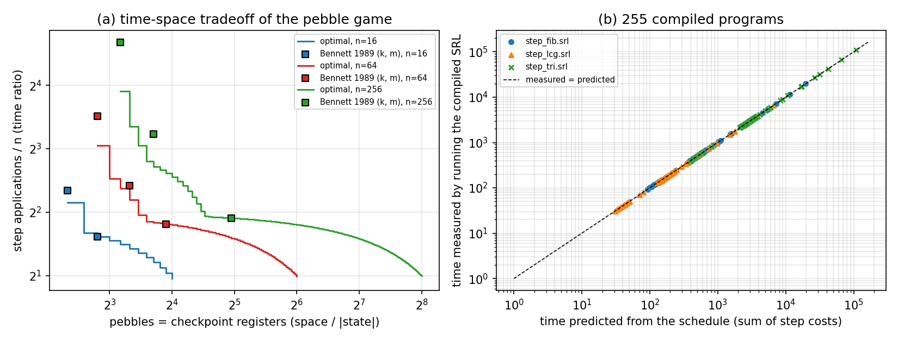

# Multi-level Bennett in RFCL: measured time-space tradeoff curves

## Question

`pyrev_fl/tradeoff.py` used to announce a multi-level Bennett transform but
implemented only one level. `pyrev_fl/pebble.py` now implements it. What
tradeoff does it give, and how close is Bennett 1989's (k, m) scheme to the
best schedule under the same space?

## What is implemented

A computation is a chain x_0 → x_1 → … → x_n of one step program
`(X) (X Y) (temps)` (reads X, writes the next state into Y from zero, cleans
its temps). Which checkpoints exist at any time is a configuration of the
reversible pebble game on the path 0–1–…–n (a pebble on i may be placed or
removed only while i−1 has one; node 0 is the input and is not counted; the
game ends with only n pebbled). `compile_pebbling` expands a schedule into a
clean straight-line SRL program: each move is one renamed copy of the step,
or of its inverse (`invert_block`), between two checkpoint registers.
Registers are reused, so the program declares exactly one register per
pebble.

Schedules:

| family | moves | pebbles | source |
|---|---|---|---|
| `linear_schedule(n)` | 2n − 1 | n | Bennett 1973 (history, then erase) |
| `bennett_schedule(k, m)`, n = m^k | (2m − 1)^k | k(m − 1) + 1 | Bennett 1989 |
| `optimal_schedule(n, s)` | min over the recursion T(n,s) = min_m T(m,s) + T(n−m,s−1) + T(m,s−1) | ≤ s | recursion of Knill 1995 |

`bfs_min_moves` searches all configurations exhaustively. It equals the
recursion on every (n, s) with n ≤ 18 (171 pairs; 78 of them in the unit
tests). For larger n, "optimal" below means optimal *within that recursion*.

CLI: `python3 -m pyrev_fl.cli pebble examples/step_fib.srl 0 1 --steps 64 --pebbles 7`
(`--levels K --segments M` for Bennett 1989, `--linear`, `--emit` for the SRL).

## Result 1: the measured cost is exactly the schedule's cost

`sweep.py` compiled and ran 255 programs: n ∈ {16, 64}, every corner of the
optimal curve plus all Bennett points; n = 256, 8 schedules; each with three
steps. The steps are Fibonacci (straight line, |X| = 2), a 4-to-1 LCG
x ↦ (5x+3) mod 64 (straight line, |X| = 1) and `step_tri.srl` (a loop whose
iteration count depends on x, |X| = 1, 2 temps). On all 255 runs:

* the result equals x_n from iterating the step program;
* measured time = Σ over moves of the step's measured cost at that node
  (forward or inverse). For straight-line steps this is moves × step
  length; for `step_tri` it is data dependent and still exact;
* declared variables = |X|·(pebbles + 1) + |temps|, and the peak of non-zero
  variables is at most that.

So on these programs RFCL's time/space *is* the pebble game's moves/pebbles,
with no hidden constant (compare the +5 control steps of the one-level
transform, `experiments/pebbling/REPORT.md`). Panel (b) of the figure.



## Result 2: the tradeoff curve, and Bennett 1989 against it

Panel (a): time ratio (moves / n) against pebbles. With s pebbles the
farthest reachable node is 2^(s−1) (exhaustive search, s ≤ 5 in the tests;
the recursion gives the same bound for every s). The curve falls steeply
from the minimum pebble count s = ⌈log₂n⌉ + 1 and then flattens into the
linear regime (2n − 1 at s = n).

| n | Bennett (k, m) | pebbles | Bennett moves | optimal, same pebbles | saving | pebbles optimal needs for Bennett's moves |
|---|---|---|---|---|---|---|
| 16 | k=4, m=2 | 5 | 81 | 71 | 12.3 % | 5 |
| 16 | k=2, m=4 | 7 | 49 | 49 | 0 | 7 |
| 64 | k=6, m=2 | 7 | 729 | 531 | 27.2 % | 7 |
| 64 | k=3, m=4 | 10 | 343 | 293 | 14.6 % | 9 |
| 64 | k=2, m=8 | 15 | 225 | 225 | 0 | 15 |
| 256 | k=8, m=2 | 9 | 6561 | 3835 | 41.5 % | 9 |
| 256 | k=4, m=4 | 13 | 2401 | 1685 | 29.8 % | 11 |
| 256 | k=2, m=16 | 31 | 961 | 961 | 0 | 31 |

* Binary Bennett (m = 2) sits at the minimum pebble count but costs 3^k
  moves; the optimum at the same count costs 1, 3, 9, 25, 71, 193, 531, 1431
  for s = 1..8 against 3^(s−1). The gap grows with n: 12 %, 27 %, 42 % for
  n = 16, 64, 256. At n = 8 and 16 the optimum is confirmed by exhaustive
  search.
* Two-level Bennett (k = 2, m = √n) is on the curve in all three cases.
* In between (k = 3 at n = 64, k = 4 at n = 256) the optimum is cheaper at
  the same space, or equally fast with 1–2 fewer pebbles.

Bennett 1989's formulas themselves are reproduced exactly: time
T·((2m−1)/m)^k, space S·(k(m−1)+1) with S = |X| per checkpoint.
The old docstring's "T·2^k time, S + k·log₂T space" is neither (fixed in
`tradeoff.py`).

## Prior work

Everything about the pebble game itself above is known; this experiment
reproduces it, it does not extend it (checked against the papers' text).

* The recursion is Knill 1995, Theorem 2.1 (E. Knill, "An analysis of
  Bennett's pebble game", arXiv:math/9508218), with the same three terms.
  The reach bound "finite iff n ≤ 2^(S−1)" is his Theorem 2.3. His Tables 1–2
  list the exact optima; F(2^(s−1), s) = 1, 3, 9, 25, 71, 193, 531 for
  s = 1..7 agrees with ours. (s = 8, n = 128, is outside his table; 1431
  agrees with the lab's independent Lean development,
  `reversible-pebbling-lean/FINDINGS-B1.md`.)
* Li, Tromp and Vitányi (Physica D 120, 1998; arXiv:quant-ph/9703009),
  Corollary 4 and footnote 3: with node 0 counted separately, the same reach
  2^(s−1), and 3^n moves for the binary scheme. Their Theorem 6(i) gives the
  matching lower bound on pebbles.
* Bennett 1989 (SIAM J. Comput. 18(4):766–776, doi:10.1137/0218053), proof of
  Theorem 1: k^n segments in (2k−1)^n stages with at most n(k−1) stored
  checkpoints (his k, n are our m, k).

None of these papers states the Bennett-versus-optimum percentages in the
table above, but they follow directly from their published values. The
contribution here is on the language side: the schedules become clean SRL
programs whose measured time and space equal the game's moves and pebbles,
with no hidden control-flow constant.

## Limitations

1. The compiled program is straight-line, so its size equals its running
   time (one copy of the step per move). A loop/recursion-based encoding of
   the schedule would need a pebble stack or index arithmetic in SRL; not
   done.
2. Space counts checkpoint registers of |X| variables each. It ignores the
   step's temps (shared, constant) and bit widths.
3. The recursion's optimality beyond n = 18 rests on the recursion, not on
   exhaustive search in this repository.
4. The chain model assumes a computation that can be cut into equal steps of
   a fixed state size. Real programs (see `experiments/pebbling`) rarely
   have that shape.

## Reproduce

```
cd experiments/multilevel
python3 sweep.py      # results/schedules.csv, results/measured.csv (exit 1 if any row deviates)
python3 analyze.py    # results/fig_tradeoff.{png,pdf,svg}, results/bennett_vs_optimal.md (needs matplotlib)
```
