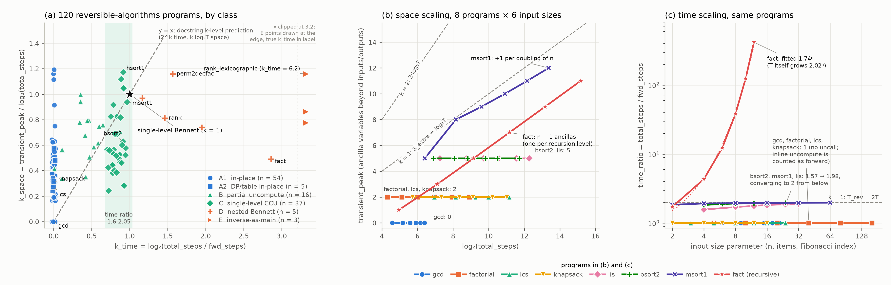

# Bennett k-level / pebbling predictions vs. real reversible programs

## Question

`pyrev_fl/tradeoff.py:9-10` predicts "single-level Bennett: T_rev ≈ 2T, S_rev = S +
O(|outputs|); k-level Bennett: T_rev ≈ T·2^k, S_rev = S + k·log₂T". Does k=1 hold for
RFCL's own transform, and does any real Janus program show the k-level shape?

## Setup

Commits: rfcl 5ea492a, PyJanus e0cd78f, reversible-algorithms edbe95c (131 files, 120
run), janus-examples 0d0081d (39 files, 16 run; 1-25-step toys, not classified).
Metrics per run: total_steps (statement executions), fwd_steps (outside any `uncall`),
time_ratio = total/fwd, transient_peak = max_live_vars − max(live_init, live_final),
k_space = transient_peak/log₂T, k_time = log₂(time_ratio).

Limitations. (1) Inline hand-written uncomputation counts as forward work, so
n_uncalls = 0 programs have time_ratio 1 by construction (`measure_corpus.py:40-47`).
(2) PyJanus's `pebble.py` double-counts aliased by-reference parameters and never drops
finished frames; `measure_corpus.py` counts over the active frame stack with alias
de-duplication (`measure_corpus.py:26-33`), so its numbers are lower than
`pyjanus --profile`. (3) One input per corpus program; six sizes for eight programs.

## Result 1: RFCL's single-level transform

`rfcl_k1_sweep.py`: 28 ok rows over 6 SRL examples (`self_interp.srl` fails its
interface check). S_pred = S + |out| + 1 (`tradeoff.py:93`) is an upper bound, tight on
24/28 rows; on the four rows with a zero output value (`bennett_rif.srl` first input 0,
`branch_copy.srl` else branch) the non-zero count is 1-2 below it. T_bennett = T_pred + 5
on all 28 rows, T_pred = 2T + |out| + 2 (`tradeoff.py:81`).

The +5: `make_reversible_program` emits `Loop(entry=(_bf==0), do=[Rif(body)],
loop=[|out| copies, _bf^=1], exit=(_bf!=0)); _bf^=1` (`bennett.py:131-141`), and
`_measure` charges one step each for loop entry, the loop-block iteration and loop exit
(`tradeoff.py:168-182`) plus one per `Rif` dispatch, forward and reverse
(`tradeoff.py:184-187`): five control steps that "copies + 2 flag ops" omits, giving
2T + |out| + 7. The docstring's k=1 space term log₂T is wrong here: the overhead is
|out| + 1.

## Result 2: the corpus



Panel (a): the 120 runnable programs by k_time and k_space; the docstring prediction is
y = x, a single-level embedding the star at (1, 1). No program lies on the line away
from the origin; the C cluster sits at k_time 0.7-0.95 with a constant ancilla.
Classes (rules applied in order):

| class | rule | n | representatives | median time_ratio / transient_peak / k_space | k-level prediction | cause of the deviation |
|---|---|---|---|---|---|---|
| A1 in-place | n_uncalls = 0 | 54 (4 with transient_peak 0) | gcd, bsort1, hsort2, avl_insert | 1.00 / 2.5 / 0.42 | k = 0, S_extra = 0 | reversible as written; ancilla = loop/index variables |
| A2 DP/table in-place | n_uncalls = 0, family dp/floyd_warshall/bellman_ford | 5 | knapsack, lcs, edit_distance, floyd_warshall | 1.00 / 2 / 0.31 | k = 0; pebbling would charge the table as garbage | table is the output (live_final 5-11) |
| B partial uncompute | n_uncalls > 0, time_ratio < 1.6 | 16 | dijkstra, qsort2, minheap_Nohr2015, avl_search | 1.34 / 4 / 0.65 | between k = 0 and 1 | only a sub-procedure is call/uncalled |
| C single-level CCU | 1.6 ≤ time_ratio ≤ 2.05 | 37 | bsort2, msort1, hsort1, lis | 1.81 / 4 / 0.56 | k = 1: 2T; S + log₂T (docstring) or S + O(|out|) (Bennett) | extra forward work in main; ancilla constant (4), not log₂T |
| D nested Bennett | time_ratio > 2.05 | 5 | fact, perm2decfac, rank, isort1 | 2.96 / 9 / 0.81 | T·2^k, S + k·log₂T | call+uncall per recursion level: k = depth, ~1 ancilla per level |
| E inverse-as-main | n_uncalls > 0, fwd < 10 % of total | 3 | rank_lexicographic, decfac2rank, ssort1 | 18.0 / 7 / 0.86 | none | computes by uncalling a generator; time_ratio is an accounting artifact |

Corpus-wide the median transient_peak is 3 variables (max 11); 10 programs reach
k_space ≥ 1, all deep sorting or permutation-ranking recursions
(`results/deviation_table.md`, `results/classification.csv`).

## Result 3: scaling

transient_peak is flat over six sizes for gcd (0), factorial, lcs, knapsack (2),
bsort2 and lis (5): slope 0.00 vs. log₂T. msort1 gains one ancilla per doubling of n
(slope 0.95, 5 → 12) because its recursion depth is log₂n, the only series on the
k = 1 reference in panel (b), for a reason unrelated to Bennett. fact.j (recursive
call/uncall) gains one ancilla per unit of n (1 → 11) while total work doubles per unit
of n (log₂T slope 1.02); its time_ratio grows as 1.74ⁿ (fitted), 1.7 → 419 for
n = 2 → 12. CCU programs converge to 2 from below (1.57 → 1.98), never above.

## Deviations and what they suggest

With these metrics, in this corpus, T·2^k with S + k·log₂T does not occur
(the D and E rows above use the syntactic count; see Result 4). The nested
case (fact.j) is k nested compute-copy-uncompute embeddings: ×2 time and +1 ancilla per
level, i.e. S + k·c, which is what the docstring's time formula describes. Bennett
1989's k-level scheme with n segments per level gives T_rev = T·((2n−1)/n)^k and
S_rev = S·(1 + k(n−1)); the docstring pairs the time of nested embeddings with a space
term from neither scheme. The docstring should be corrected.

DP tables (A2) are outputs, not garbage, so the pebbling premise of simultaneously
available, later-erased intermediates does not apply. RC-03's cutrod is not in this
corpus; the closest is `dp/lis.j`, which uncalls a helper and lands in C. Class E
shows "forward work" needs a semantic definition, not the syntactic fwd/uncall split;
otherwise rank_lexicographic reads as a 72× overhead.

## Result 4: forward work defined by effect (`semantic_forward.py`)

Limitation (1) and class E come from one syntactic rule: a step is reverse
work iff it runs inside an `uncall`. `semantic_forward.py` replaces it with
a definition by effect. An invocation I (call *or* uncall) **strictly
uncomputes** an earlier completed invocation J of the same procedure iff
their parameters are bound to the same storage, I starts from J's exit
values and ends at J's entry values, and J changed something. Only such I
are reverse work; an uncall that nothing pairs with is forward work, and a
`call` that undoes an earlier `uncall` is reverse work. The **loose** count
also accepts a partial inverse: I returns *some* storage that J changed to
J's entry value, while other arguments differ. This is the reversible-sorting
idiom `call bsort(a, g); uncall bsort(ord, g)`: the uncall clears the
garbage g and computes the permutation in ord. Strict and loose bracket what
an invocation-level analysis can call uncomputation. Eight hand-made cases
(`semantic_cases/`, `test_semantic_forward.py`) pin the definition (10 tests); each of
five mutations of the matching rule fails at least one of them.

Over the same 120 programs (`results/semantic_classes.md`,
`results/semantic_measurements.csv`):

| class | syntactic | strict | loose |
|---|---|---|---|
| A1 | 54 | 73 | 57 |
| A2 | 5 | 5 | 5 |
| B | 16 | 22 | 22 |
| C | 37 | 19 | 32 |
| D | 5 | 1 | 4 |
| E | 3 | 0 | 0 |

* **Class E disappears under both counts.** rank_lexicographic 72.2 → 1.43,
  ssort1 16.4 → 1.51: their main `uncall` is unpaired (forward), and the
  pairs inside it are ordinary compute/uncompute. decfac2rank 18.0 → 1.0: a
  single unpaired uncall, i.e. an in-place algorithm run backwards.
* **Class D shrinks.** Under the strict count only fact.j stays nested
  (8.32; call/uncall at every level, 31 of 31 uncalls paired). isort1
  (3.86 → 1.51) and perm2decfac (2.96 → 1.43) were D only because unpaired
  uncalls were charged as reverse work. breadth_first_search and rank are
  D only under the loose count (2.16, 2.21).
* **13 of the 37 syntactic C programs have no exact pair at all** (bsort2,
  msort1, hsort1–3, several isort and shell_sort variants, queue5e). They
  are the sorting idiom above: under the loose count 31 of 37 stay in C. So
  "single-level CCU" in the corpus mostly means *garbage-clearing inverse on
  new data*, not Bennett's copy-then-uncompute on the same data.
* One loose-only false-looking case: treesort.j (no uncalls) gets 1.4 %
  reverse work from a call that restores one storage location, so its loose
  class is B. It is kept, not filtered.

Still not seen: uncomputation written inline as statements; there is no
invocation to pair.

## Reproduce

```
cd experiments/pebbling
PYJANUS=/path/to/PyJanus python3 measure_corpus.py /path/to/reversible-algorithms /path/to/janus-examples --out results
python3 rfcl_k1_sweep.py
python3 analyze.py
PYJANUS=/path/to/PyJanus python3 semantic_forward.py /path/to/reversible-algorithms
PYJANUS=/path/to/PyJanus python3 -m unittest test_semantic_forward
```

## Related measurement in progress

A sibling thread re-measures gcd, bubble sort and cutrod with PyJanus's own `pebble.py`
inside PyJanus; this experiment lives in RFCL to avoid PR collisions. Compare trends,
not absolute live-variable counts (Limitation 2).
